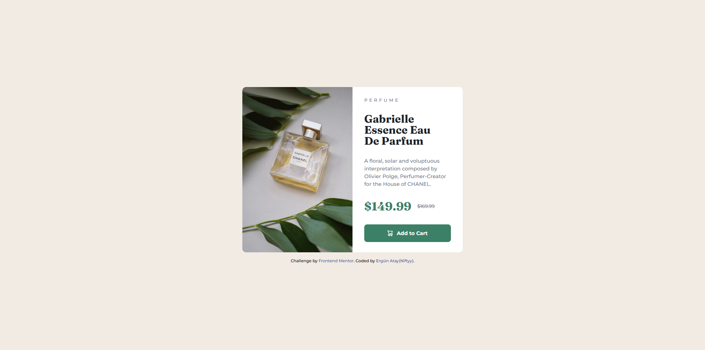

# Frontend Mentor - Product preview card component solution

This is a solution to the [Product preview card component challenge on Frontend Mentor](https://www.frontendmentor.io/challenges/product-preview-card-component-GO7UmttRfa). Frontend Mentor challenges help you improve your coding skills by building realistic projects.

## Table of contents

- [Overview](#overview)
  - [The challenge](#the-challenge)
  - [Screenshot](#screenshot)
  - [Links](#links)
- [My process](#my-process)
  - [Built with](#built-with)
  - [What I learned](#what-i-learned)
  - [AI Collaboration](#ai-collaboration)
- [Author](#author)

## Overview

### The challenge

Users should be able to:

- View the optimal layout depending on their device's screen size
- See hover and focus states for interactive elements

### Screenshot



### Links

- Solution URL: [Add your Frontend Mentor solution URL here](https://your-solution-url.com)
- Live Site URL: [Add your GitHub Pages URL here](https://ergunatay.github.io/product-preview-card-component/)

## My process

### Built with

- Semantic HTML5 markup
- CSS custom properties
- Flexbox
- Mobile-first workflow
- The `<picture>` element with `<source>` for responsive images

### What I learned

I built the desktop layout first, then added the mobile layout using a `max-width` media query. The trickiest part was handling the two differently-cropped images the design provides (a tall image for desktop, a wide one for mobile). Using the `<picture>` element with a `<source>` tag let me swap in the correct image at the right breakpoint, instead of trying to force one image to work at both sizes:

```html
<picture>
  <source media="(max-width: 40rem)" srcset="images/image-product-mobile.jpg" />
  
</picture>
```

I also learned to avoid fixed heights on the mobile layout — letting the container grow with `height: auto` and using `gap` to manage spacing between elements prevented content from overflowing or getting squished on smaller screens.

### AI Collaboration

I used Claude (Anthropic) as a collaborator while making this component responsive:

- **How I used it:** After finishing the desktop version, I shared screenshots comparing my mobile output to the provided design and worked through which CSS rules needed to change inside the media query (layout direction, widths, padding, font sizes).
- **What worked well:** Rather than rewriting everything from scratch, it helped me identify the specific lines in my existing CSS that needed to change, which let me keep my own structure and understand each fix as I applied it.
- **What was tricky:** Getting the image to crop the same way the design did took a couple of iterations before landing on the `<picture>` / `<source>` approach.

## Author

- GitHub - [ErgunAtay](https://github.com/ErgunAtay)
- Frontend Mentor - [@ErgunAtay](https://www.frontendmentor.io/profile/ErgunAtay)
